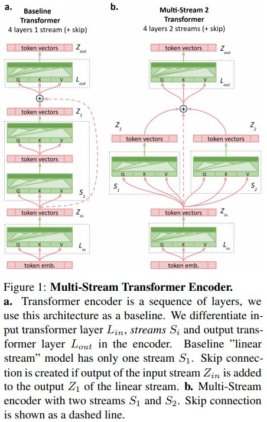

</img>

## Multistream Transformers (wip)

Implementation of <a href="https://arxiv.org/abs/2107.10342">Multistream Transformers</a> in Pytorch

## Install

```
$ pip install multistream-transformers
```

## Usage

```python
import torch
from multistream_transformers import MultistreamTransformer

model = MultistreamTransformer(
    num_tokens = 256,         # number of tokens
    dim = 512,                # dimension
    depth = 4,                # depth
    max_seq_len = 1024,       # maximum sequence length
    num_streams = 2           # number of streams
)

x = torch.randint(0, 256, (1, 1024))
mask = torch.ones((2, 1024)).bool()

logits = model(x, mask = mask) # (1, 1024, 256)
```

## Citations

```bibtex
@misc{burtsev2021multistream,
    title   = {Multi-Stream Transformers}, 
    author  = {Mikhail Burtsev and Anna Rumshisky},
    year    = {2021},
    eprint  = {2107.10342},
    archivePrefix = {arXiv},
    primaryClass = {cs.CL}
}
```
